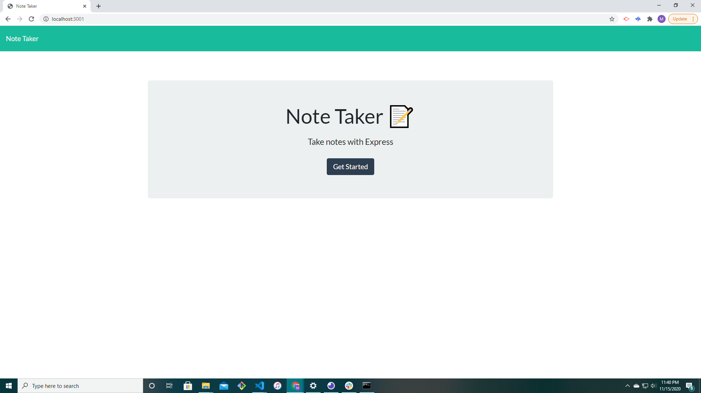
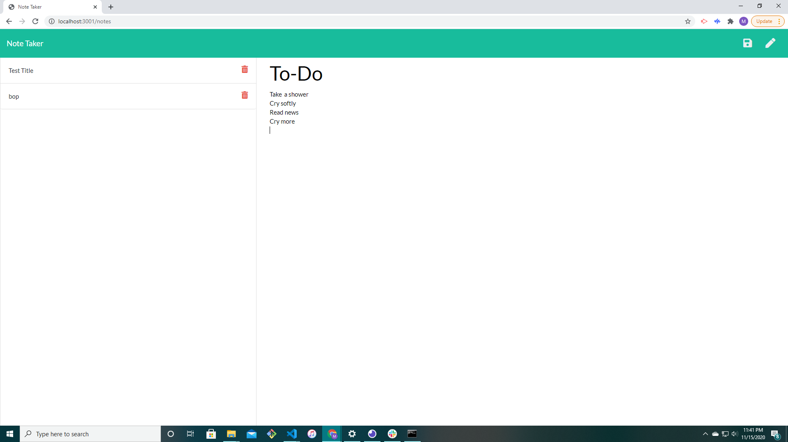

# readme-generator 

## Description 

This project is intended to be used as a detailed-note taker. Write notes that you want to save for later, and delete those that you no longer need. Built using Node.js, express, and published using Heroku pages. 

## Table of Contents 

* [Installation](#installation)
* [Usage](#usage)
* [Credits](#credits)
* [License](#license)

## Installation
    npm i uuid
    npm i express

## Usage 
Use this app any time that you need to write a some notes. 
Deployed app: https://note-takrr.herokuapp.com/
[]
[]

## CREDITS

## License

MIT

# Contact Me
Feel free to contact me if you have any questions about this project. I can be reached by email at msatori.code@gmail.com